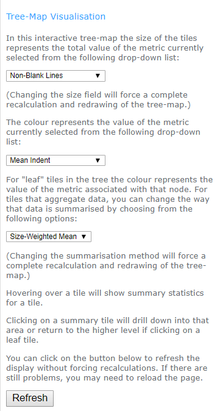

= _swmetrics_: User Manual
Neil Winton <neil.winton@bt.com>
:toc:
:toclevels: 3

== Introduction

The main purpose of *swmetrics* tool is to generate a number of metrics
about (principally) source code. The metrics can be generated either
from checked out local files or from version control system (Git or
Subversion) command output.

The tool also provides a means to visualise those metrics using
https://en.wikipedia.org/wiki/Treemapping[tree-maps].

The *swmetrics* tool is inspired by ideas from Adam Tornhill's
excellent book
https://pragprog.com/book/atcrime/your-code-as-a-crime-scene["`Your
Code as a Crime Scene`"]
and, particularly, some of the ideas in the paper
http://ieeexplore.ieee.org/document/4556125/["`Reading Beside the
Lines: Indentation as a Proxy for Complexity Metrics`"]
that is referred to in that book.

Adam Tornhill developed some open source tools under the
https://github.com/adamtornhill/code-maat[code-maat] project on GitHub
and later commercialised his ideas at http://codescene.io[codescene.io].

You can also watch a https://www.youtube.com/watch?v=qJ_hplxTYJw[talk
Adam gave at a TEDx conference] -- it's not essential to understand this
tool, but you may find it interesting.

While this tool takes insipration from the book and **code-maat**, it
shares no code with them and is a completely fresh, from-scratch
implementation.

== Command-line usage

The tool is distributed as a single, standalone Java jar file. The
usage, as reported by the tool's `--help` option is as follows:

....
usage: java -jar swmetrics.jar [options] file-or-directory ...
 -a,--show-annotated                        Show source file annotated
                                            with indent levels
 -A,--extra-column <column name>            Select this column as
                                            additional data for
                                            visualisation (may be
                                            repeated)
    --author-paths                          With --vcs-log, generate data
                                            about authors and paths they
                                            have touched
    --author-stats                          With --vcs-log, generate
                                            statistics about authors, not
                                            paths
 -B,--bottom-threshold <number>             Set the bottom end of the
                                            range threshold (default mean
                                            - 3 std-devs)
    --bottom-colour <rgb-colour>            Use this colour at the bottom
                                            end of the scale (default
                                            #00ff00)
 -c,--csv                                   Output results in CSV format
 -C,--colour-column <name or index>         Select this column as the
                                            "colour" metric for
                                            visualisation (default 3)
 -d,--debug                                 Turn on debug logging
    --full                                  Outputs extra statistics in
                                            CSV reports
 -h,--help                                  Show this message and exit
 -i,--include <pattern>                     Include only paths matching
                                            pattern (may be repeated for
                                            multiple patterns)
 -j,--join-csv-files <left-col=right-col>   Join two CSV files on the
                                            specified column names
    --join-type <inner or outer>            Specify the join type for
                                            joining CSV files
 -L,--level-limit <level>                   Limits the depth level of a
                                            generated tree-map
 -n,--ignore-prefix <path-prefix>           Ignore this prefix in
                                            comparing paths
    --overall-only                          Outputs only overall
                                            consolidated file metrics
 -P,--path-column <name or index>           Select this column as the
                                            "path" data for visualisation
                                            (default 1)
    --partition-size <number>               Set the number of tiles in a
                                            tree-map before it is
                                            partitioned (default 500)
 -R,--resource-path <path-prefix>           Link to resources under this
                                            path, instead of embedding
 -S,--size-column <name or index>           Select this column as the
                                            "size" metric for
                                            visualisation (default 2)
 -t,--treemap <"jit" or "d3">               Generate HTML/JavaScript
                                            tree-map visualisation
 -T,--top-threshold <number>                Set the top of the range
                                            threshold (default mean + 3
                                            std-devs)
    --tab-size <number>                     Specify the tab size for
                                            expansion (default 4)
    --title <text>                          Set the title text for the
                                            visualisation
    --top-colour <rgb-colour>               Use this colour at the top end
                                            of the scale (default #ff0000)
 -v,--vcs-type <"git" or "svn">             Specify the VCS type for
                                            --vcs-log, vcs-list or
                                            vcs-diff
    --vcs-diff <file-name>                  Process output from VCS diff
                                            command
    --vcs-list <file-name>                  Process output from VCS list
                                            command
    --vcs-log <file-name>                   Process output from VCS log
                                            command
 -x,--exclude <pattern>                     Exclude any paths matching
                                            pattern (may be repeated for
                                            multiple patterns)
....

In practice, the options group into sets, depending on the primary
operation being performed. They are described in more detail in the
following sections.

== Generating metrics

The first purpose of the tool is generating metrics, either from examining
local files or from version control system data.

=== Local file metrics

Without any other options the default operation of the tool is to
analyse files or directories named on the command-line. Apart from
the number of lines in the file the main metrics that the tool
calculates are based on analysing the indentation patterns of the code.
These can reveal a surprising amount, in a completely language independent manner.

Consider the two pictures below. Even without knowing anything about the
programming language or purpose, you can see that the code on the left is
likely to be considerably more complex than that on the right, just
based on its shape.

[cols="^,^",options="header",]
|==================================================================
|Complex |Simple
| |
|==================================================================

You might guess, rightly, that the diagonal "`cascade`" near the
bottom of the complex figure is indicative of a large number of nested
condition or loop statements being closed. When you learn that the
figure on the left represents a single method in a (much, much)
larger class while the figure on the right is the entire class
(with many, very small methods) you can again see how much can be
gleaned just from some very simple observations about indentation.

The http://ieeexplore.ieee.org/document/4556125/[paper from 2008]
referenced aboved explored this in detail and determined that
indentation metrics correlate well with other "`standard`" complexity
measures such as the
https://en.wikipedia.org/wiki/Halstead_complexity_measures[Halstead] and
https://en.wikipedia.org/wiki/Cyclomatic_complexity[McCabe cyclomatic
complexity] measures. Analysis of some of our own code bases, comparing
the metrics for code produced by https://www.sonarqube.org/[SonarQube],
indicates that this is indeed still the case.

==== How is the indentation level calculated?

The simplest way of calculating indentation is merely to count the
number of leading whitespace characters at the beginning of each line.
However, that's complicated by things like tabs -- and the propensity of
programmers not to be consistent in how code is laid out, even within
the same module! A "`logical`" unit of indentation might be one space or
four, a single tab or (heaven forbid) a mixture of spaces and tabs.

The approach this tool takes to calculate the "`logical`" indentation
level is as follows. First, tabs in leading whitespace are expanded to
spaces. By default it assumes that 1 tab = 4 spaces, but this can be
changed using the link:#tab-size[`--tab-size`] command-line option if
you know that your code is formatted differently. Then the tool looks at
the relative indentation of each line. If a line is prefix by more
spaces than its predecessor (by however many spaces) then the
indentation level increases by one. If the amount of whitespace
decreases then the indentation level decreases. However, it may decrease
by _more than one level_ if its overall indentation takes in below the
immediately preceding levels.

To see what this means consider the following file (where leading spaces
are represented by "`.`" characters so you can see them more clearly):

....
alpha
..beta
....gamma
....delta
..epsilon
......zeta
........eta
...theta
.iota
....

The calculated indentation levels are as follows:

....
 0: alpha
 1: ..beta
 2: ....gamma
 2: ....delta
 1: ..epsilon
 2: ......zeta
 3: ........eta
 1: ...theta
 0: .iota
....

So, the *theta* line is at indentation level 1 (like **epsilon**)
despite it having one more leading space. This is because it is less
indented than both *eta* and *zeta* which precede it. This may sound
complicated, but it generally works out fairly well, and usually
reflects the programmer's intent.

It should be obvious that if a line has no leading whitespace at all then
it is, by definition at indentation level zero!

==== What metrics are calculated?

From its analysis of (text) files the tool extracts the following
metrics.

Total number of lines::
Fairly obvious!

Number of non-blank lines::
A blank line is one is either entirely empty or contains only
white-space.

Total indent::
The total amount of indentation for all non-blank lines in the file.

Min, max, mode, mean and standard deviation of the indentation level::
The normal statistical meanings of these values, for all non-blank
lines. The minimum value is very likely to be, but not always, zero.

Level counts::
The counts of the number of lines at each indentation level.

Probable function indent::
This value is the most common level of indentation greater than zero, if
there are any (or zero otherwise). In other words, it's the level at
which you'll find most lines of code (assuming that the file being
examined is software). For most languages, and for well-structured code,
this will probably represent the body text of most
functions/methods/procedures.
+
For example, for Java, this will probably be two -- indent level zero
being the package, imports and class declarations, level one being a
method name or member variables and and level two being the body of the
methods.
+
The tool has no knowledge of any language syntax, only the indentation
patterns so this is a guess as to where function body text lies, in the
absence of any other information.

Level span count, min, max, mean and standard deviation::
For each indentation levels 1 to 3, a "span" is a sequence of lines at
or above that level of indentation. So, consider the following file data
(here the "..." just fills out the line to make it easier to read, they
don't represent spaces):
+
....
A ...
    B ...
    B ...
        C ...
        C ...
    B ...
A ...
    B ...
        C ...
            D ...
        C ...
        C ...
    B ...
    B ...
A ...
    B ...
A ...
....
+
There are three spans at level 1: the first of 5 lines (B, B, C, C, B),
the second of 7 lines (B, C, D, C, C, B, B) and the last of 1 (B). There
are two spans at level 2: the first of 2 lines (C, C) and the second of
4 (C, D, C, C). Finally there is a single span at level 3, consisting of
the D line.
+
If you know what the expected function level span is (e.g. level 2 for
Java) then these metrics will tell you roughly how many functions there
are in a file, and statistics about their size, such as the mean length.

==== Running the tool

Invoking the following command:

 java -jar swmetrics.jar build.gradle

Might produce output something like these statistics for the
_build.gradle_ file in the current directory:

....
 ==== E:\work\swmetrics\build.gradle ====
 Total lines: 41, Non-blank lines: 34
 Total indent: 30, Min indent: 0, Max indent: 3
 Mean indent: 0.882, Std Deviation: 0.758, Mode indent: 1, Probable function indent: 1
 ----
 Histogram:
  0: ################################ 11
  1: ################################################## 17
  2: ############## 5
  3: ## 1
 ----
 Span statistics:
 Level 1 - Count: 3, Min: 5, Max: 10, Mean: 7.667, StdDev: 2.055
 Level 2 - Count: 3, Min: 1, Max: 3, Mean: 2.000, StdDev: 0.816
 Level 3 - Count: 1, Min: 1, Max: 1, Mean: 1.000, StdDev: 0.000
 ----
....

By default, the metrics described above are output in a human-consumable
format. The number of lines at each level are shown as an ASCII
histogram.

To see an annotated version of the file showing what indentation level
the tool has calculated for each line, you can use the
link:#show-annotated[`-a`] option (or
link:#show-annotated[`--show-annotated`] if you like typing).

You can name multiple files on the command-line or give it the paths of
directories. In the latter case the tool will descend recursively down
into these directories and print out the metrics for files within them.
It will only process files that it determines (heuristically) to be text
files.

You can use the options to specify patterns to include only paths that
match the specified regular expression pattern (the
link:#include[`-i/--include`] option) or exclude paths matching patterns
(the link:#exclude[`-x/--exclude`] option).

==== CSV output format

This default operation of the tool is useful for a quick assessment of a
few files, but it's rather cumbersome and verbose for bulk operation.
So, if you add the link:#csv[`--csv`] option the output will be printed
in a CSV format, which can be redirected and saved for futher
examination and use. For example, the command:

 java -jar swmetrics.jar -i '\.groovy$' --csv . > groovystats.csv

will search for all files under the current directory whose names end
with `.groovy` and output the details in CSV format.

Most of the columns in the CSV output should be fairly obvious, and
align with the metrics described above, but for completeness they are
described in the following table.

[width="75%",cols="^33%,<67%",options="header",]
|=======================================================================
|Column |Meaning
|Path |The path to the file. This is URI-encoded (see below).

|Total Lines |The total number of lines in the file.

|Non-Blank Lines |The total number of non-blank lines in the file.

|Total Indent |The total amount of (logical) indentation in the file.

|Mean Indent |The mean line indentation.

|Std Dev Indent |The standard deviation of the line indentation.

|Max Indent |The maximum indentation level found in the file.

|Mode Indent |The mode (most common) indentation level.

|Level __N__+ %|The percentage of lines at or above level _N_ (for 1
to 9).

|Level _N_ Lines footnoteref:[full-stats-1,These columns are not included by default because
   they are not usually that interesting. They can, however, be enabled in the
   output by using the link:#full[`--full`] option.] |The number of lines at indent level _N_ (for levels 0 to 9).

|Span _N_ Count |The number of level _N_ spans (for levels 1 to 3).

|Span _N_ Min footnoteref:[full-stats-1] |The minimum size of a level _N_ span.

|Span _N_ Max |The maximum size of a level _N_ span.

|Span _N_ Mean |The mean size of a level _N_ span.

|Span _N_ Std Dev footnoteref:[full-stats-1] |The standard deviation of level _N_ span sizes.

|=======================================================================

===== URI-encoding of path names

Paths in the CSV output are URI-encoded. This means, for example, that a
space is encoded as "`%20`" and a "`#`" character as "`%23`". It also means
that, regardless of the operating system being used, the path element
delimiter is a forward slash ("`/`") character. This is done for
consistency with other sources of names, of which more below!

[[version-control-system-metrics]]
=== Version control system metrics

The second potential source of metrics is from analysing version control
system (VCS) command output, in particular, that from Subversion and
Git.

==== Analysing log data

Data from either `svn log` or `git log` can be used to derive a number
of metrics.

The first pre-requisite is to run a command to generate processible log
output. This is, unexpectedly, different for Subversion or Git.

===== Subversion

The command to run for Subversion is something along the lines of the
following:

....
svn log -v --xml some-location > svnlog.xml
....

This could be done against a local working copy or a remote URL. Note
that you must use the `--xml` option to generate XML-format output and
the `-v` option to include all the data that is needed.

===== Git

The equivalent command for Git (which must be run against a local clone)
is:

....
git log --name-status --find-renames --find-copies > gitlog.out
....

You might want to use the (much more computationally expensive)
`--find-copies-harder` option to ensure the full history is picked up
for copied files, but this is not vital.

You can also use a more customised version of the log command, which
omits data that isn't used in the processing. This command is:

....
git log --format='date %cI%nauthor %ce' --name-status --date=iso-strict --find-renames --find-copies > gitlog.out
....

As shown above the data will use the commit date and committer e-mail.
You can choose to use the author date (`%aI` instead of `%cI`) and an
alternative value for the the name -- but you must keep the date in
"strict ISO" form and ensure that there are lines beginning `date` and
`author`.

==== Running the analysis

For either VCS the log command output can be analysed with the tool by
using the link:#vcs-log[`--vcs-log`] option, like this:

....
java -jar swmetrics.jar --vcs-type svn --vcs-log svnlog.xml > output.csv
....

Note that you also have to specify the link:#vcs-type[`--vcs-type`]
option (or `-v` for short) to say whether the log file input is in
Subversion (`svn`) or Git (`git`) format.

In this case, the output is always in CSV-format, so there is no need to
specify the `--csv` option. The columns in the CSV output are given in
the table below. Note that there will be details for both files and
directories included.

[width="75%",cols="^33%,<67%",options="header",]
|=======================================================================
|Column |Contents
|Path |URI-encoded path.

|Size |The size, in bytes, of the file or 0 for a directory.

|Last Commit Age Days |The number of days since the last commit to the
path, relative to the newest commit in the input data.

|Last Commit Date |The timestamp of the last commit.

|Last Committer |The name of author of the last commit.

|Total Commits |Total number of commits to this path.

|Aged Commit Value |See <<Aged commits>> below.

|Lifetime Days |The number of days between the first and last commit.

|Active Days |The number of days on which at least one commit was made.

|Lifetime Change Rate |The average number of commits per day over its
lifetime.

|Main Committer |The author with the most commits to the path.

|Main Committer Percent |The percentage of commits belonging to the main
committer.

|Total Committers |The total number of distinct committers.
|=======================================================================

Note that the actual size of files isn't available in the log output so
all of the "`Size`" column values are shown as 1. This may be useful in
the aggregation operations of the <<Data visualisation,visualisation>> functionality described later.

===== Aged commits

There is only one column whose value probably isn't obvious, and that is
the "`Aged Commit Value`".

A file may have had many commits to it over its lifetime, but the total
number of commits doesn't, in itself, give a picture of how actively it
is being modified. For this reason the tool calculates the a value based
on giving commits a "`half-life`" of 6 months (180 days). So a commit made
180 days ago is considered to have a value that is one half of one made
today, a commit 360 days ago has a value of 0.25, and so on. The "`aged
commit`" value is the sum of all of these adjusted values, where the age
(in days) is baselined against the most recent commit in the input file.

==== Author statistics

Instead of generating statistics about the files modified in the commit
history, the tool can also generate statistics about the authors of the
commits. If you supply the link:#author-stats[`--author-stats`] option
along with link:#vcs-log[`--vcs-log`] then the CSV output will contain
the following columns:

[width="75%",cols="^33%,<67%",options="header",]
|=======================================================================
|Column |Contents
| Author |The author of one or more commits.

| Total Commits |The total number of commits made by the author.

| Total Paths |The total number of unique paths changed (added,
modified or deleted) by the author.

| Tenure |The time in days between the author's first and last commit,
the time they have worked on the project.

| Active Days |The number of days on which the author made a commit.

| Revisited Paths |The total number of unique paths changed more than
once.

| First Commit |The date and time of the author's first commit.

| First Commit Age |The age in days of the first commit, relative to
the latest date of any commit in the log.

| Last Commit |The date and time of the author's last commit.

| Last Commit Age |The age in days of the last commit, again relative
to the lastest commit in the log.
|=======================================================================

If the link:#full[`--full`] option is supplied then
columns will be added for every month of the project's life (from the
time of the earliest commit in the log to the latest) showing the total
number of commits, and total number of paths modified for that month by
the author.

===== Authors and committed paths

It can sometimes be useful to see exactly which files have been modified
by which authors, and when. If you use the
link:#author-paths[`--author-paths`] option with
link:#vcs-log[`--vcs-log`] then simple CSV output with the following
columns is generated:

[cols="^33%,<67%",options="header",]
|=======================================================================
|Column |Contents
| Author |The author of one or more commits.

| Path |A path modified by the author.

| First Commit |The date and time of the author's first commit to the
path.

| Last Commit |The date and time of the author's last commit to the
path.

| Total Commits |The author's total commits to the path.
|=======================================================================

The author/path combination is repeated for each path modified by an
author, so this output could be very large for a very active, large
repository with many committers.

[[analysing-list-data]]
==== Analysing list data

For Subversion, but not for Git, it is possible to obtain some
additional details from a remote repository by using the `svn list`
command, as follows:

 svn list -R --xml some-location > svnlist.xml

This can be done against a local working copy instead of a remote URL,
but in this case you already have more information available locally so
it is less useful.

Note that, again, you must use the `--xml` option to generate XML-format
output.

The XML data-file can be analysed with the tool by using the
link:#vcs-list[`--vcs-list`] option, like this:

 java -jar swmetrics.jar --vcs-type svn --vcs-list svnlist.xml > output.csv

The output is a subset -- the first five columns -- of that produced
from a log file using link:#vcs-log[`--vcs-log`]. However, the list data
does contain files sizes in bytes.

==== Combining Subversion list and log output.

If output files from both `svn list` and `svn log` commands are
available then, if supplied to the tool at the same time, they can be
combined. The main effect of this is to provide a real size value to the
output from `svn log` data alone.

However, there is a slight complication. It is very likely that the
paths in the `log` and `list` outputs will differ. In particular, the
`log` output will probably have full paths relative to the repository
root, while the `list` output may only have partial, relative paths.

In order to make sure that the paths can be matched you will have to use
the link:#ignore-prefix[`--ignore-prefix`] (or `-n`) option in order to
specify path prefixes to ignore when comparing them across the two
data-sets.

So, if the if the `list` file was generated within a working copy
checked out from the trunk of a repository into a directory "local" then
its paths might start with `local/...` whereas the `log` file data might
start with `/trunk/...`. So in this example the two files would be
processed like this:

....
java -jar swmetrics.jar --vcs-type svn --vcs-list list.xml --vcs-log log.xml -n "local/" -n "/trunk/"
....

You don't have to have the trailing slashes on the path prefixes -- the
tool understands that paths are separated by "`/`" characters. This means
that a prefix of "`foo`" will be ignored on `foo/bar/baz` (and will be
considered the same as `bar/baz` on its own) but it won't match
`foobar/baz` at all.

Any matching prefix is ignored in either set of data, so there is no
special ordering of the options required. Also, note that the the
ignored prefixes will be stripped from the paths in the output files.

[[analysing-diff-data]]
==== Analysing diff data

As well as VCS log data the tool can also analyse the results from
"`diff`" commands which show the differences in files introduced by
changes. It can handle the output from either `svn diff` or `git diff`
(which is very similar for either VCS). Depending on the options used
when generating a diff file, it may represent the results of a single
change or many. The tool is agnostic to this, and just sees the file as
representing "`before`" and "`after`" states.

Given a Git diff output file `gitdiff.out` the tool is run as follows:

  java -jar swmetrics.jar --vcs-type git --vcs-diff gitdiff.out

The default output is in a textual form and looks like this:

....
=== src/main/groovy/com/bt/swmetrics/vcs/DiffParser.groovy
    1 chunk, 25 lines added, 2 lines removed
    Change in total indent: 36
    Before: mean indent: 0.500, max indent: 1, standard deviation: 0.500
    After:  mean indent: 1.560, max indent: 3, standard deviation: 0.898

=== src/main/groovy/com/bt/swmetrics/vcs/DiffStatsReporter.groovy
    2 chunks, 2 lines added, 2 lines removed
    Change in total indent: 0
    Before: mean indent: 1.100, max indent: 2, standard deviation: 0.539
    After:  mean indent: 1.100, max indent: 2, standard deviation: 0.539
....

You can generate CSV-format output by adding the `--csv` option, like
this:

  java -jar swmetrics.jar --vcs-type git --vcs-diff gitdiff.out --csv > output.csv

The columns in the resulting CSV file are as follows:

[width="75%",cols="^33%,<67%",options="header",]
|=======================================================================
|Column |Contents
|_Path_ |The (URI-encoded) path of a file.

|_Chunks_ |The number of "chunks" in the diff -- the number of different
regions modified in the file.

|_Lines Added_ |The number of lines added in the change.

|_Lines Removed_ |The number of lines removed in the change.

|_Indent Change_ |The overall change in indentation (which may be
negative).

|_Mean Before_ |The mean indent of the lines in the chunks before the
change.

|_Mean After_ |The mean indent after the change.

|_Std Dev Before_ |The standard deviation of the indent in the chunks
before the change.

|_Std Dev After_ |The standard deviation after.

|_Max Before_ |The maximum indent in the chunks before the change.

|_Max After_ |The maximum indent after.
|=======================================================================

===== How is diff indent calculated?

The process for calculating the indentation statistics for a whole file
are described in
link:#How%20is%20the%20indentation%20level%20calculated?[How is the
indentation level calculated?] above. However, in a diff file we are
only dealing with fragments, not whole files. It is one of the
advantages of using indentation as a metric that you can calculate some
(we hope!) meaningful values just from these fragments.

A diff file (in this case from Git) looks something like this:

....
diff --git a/src/main/groovy/com/bt/swmetrics/vcs/AuthorStats.groovy b/src/main/groovy/com/bt/swmetrics/vcs/AuthorStats.groovy
index b9c4c5b..e091d32 100755
--- a/src/main/groovy/com/bt/swmetrics/vcs/AuthorStats.groovy
+++ b/src/main/groovy/com/bt/swmetrics/vcs/AuthorStats.groovy
@@ -8,8 +8,9 @@ import java.time.temporal.ChronoUnit

     void addCommit(Instant when, List<String> paths) {
         commitDates << when
         paths.each { path ->
-            pathCommitMap[path] = pathCommitMap[path] ? pathCommitMap[path] + 1 : 1
+            pathCommitInstants[path] = pathCommitInstants[path] ?: []
+            pathCommitInstants[path] << when
         }
     }

@@ -22,7 +23,7 @@ class AuthorStats {
     }

     Map<String,Integer> getPathCommits() {
-        this.pathCommitMap
+        this.pathCommitInstants.collectEntries { path, times -> [(path): times.size()] } as Map<String,Integer>
     }

     Map<OffsetDateTime,Integer> monthlyTotals(Instant start, Instant end) {
....

This shows the changes for one file, and consists of two "`chunks`". The
lines added or deleted (prefixed with "`+`" or "`-`") are surrounded by some
additional context -- by default 3 lines. This means that, atlhough the
absolute indentation level may not be clear, the indent relative to the
surroundings can be calculated. So, what the tool does is to take each
chunk and work out the indentation levels for the "`before`" lines and the
"`after`" lines. In the example above, for the first chunk the "`before`"
lines (ignoring blanks) with their indentations are:

....
1:   void addCommit(Instant when, List<String> paths) {
2:       commitDates << when
2:       paths.each { path ->
3:           pathCommitMap[path] = pathCommitMap[path] ? pathCommitMap[path] + 1 : 1
2:       }
1:   }
....

This gives a total indent of 11. The "`after`" lines are:

....
1:   void addCommit(Instant when, List<String> paths) {
2:       commitDates << when
2:       paths.each { path ->
3:           pathCommitInstants[path] = pathCommitInstants[path] ?: []
3:           pathCommitInstants[path] << when
2:       }
1:   }
....

This has a total indent of 14, so in this case, the overall indent has
changed by three although the number of lines has only increased by one.
Although we don't know from the fragment what the absolute indentation
level was, we do know that the modification has been at least three
levels deep.

These individual chunk line indentations are combined to calculate the
mean, standard deviation and maximum values as for a file within the
diff. The absolute values are, perhaps, of less interest than the
changes between the before and after values. So, in the following
output:

....
=== src/main/groovy/com/bt/swmetrics/vcs/AuthorStats.groovy
    1 chunk, 25 lines added, 2 lines removed
    Change in total indent: 36
    Before: mean indent: 0.500, max indent: 1, standard deviation: 0.500
    After:  mean indent: 1.560, max indent: 3, standard deviation: 0.898
....

we can see that this change does seem to have added new complexity to
one region of a file (there is only one chunk). Whether the change, for
example, from a mean indent of 0.5 to 1.56 is "`bad`" depends on a
knowledge of the language and enviroment -- in Java it might merely
indicate the addition of a couple of simple new methods. However, a
change from a maximum indent of 1 to 10, for example, would almost
certainly highlight an issue.

==== Combining file metrics and VCS data

You may wish to combine both file metric and VCS data into a single CSV
file. This could be done using a mechanism such as _vlookup()_ in
Microsoft Excel, or with various UNIX/Linux command-line tools. However,
the *swmetrics* tool provides an easy way to do this without needing any
other software.

The basic means of joining two CSV files, based on them having matching
data in a "`Path`" column, for example, would be as follows:

  java -jar swmetrics.jar --join-csv-files "Path=Path" metrics.csv vcs.csv > joined.csv

The link:#join-csv-files[--join-csv-files] (or `-j` for short) option
takes a single argument of the form `"Left Column=Right Column"`. It
also requires the names of two CSV files to be specified. The first (or
"`left`") file must have a column named "`Left Column`" (in this example)
and the second (or "`right`") file must have column named "`Right Column`".

The result will be the combination of all columns from both files where
the paths in the left and right join columns match. In database terms
this is an "`inner`" join. If there is no match, data from neither side
will be included.

Matching on the columns disregards any prefixes specfied using the
link:#ignore-prefix[`--ignore-prefix | -n`] option. Note that in this
case matching prefixes are _not_ stripped from the output, instead the
whole of the path from the "`left`" file is included.

If column names are duplicated, those from the right-hand file are
renamed with a suffix of "`(other)`". So if there is a column "`Total`" in
both files, the joined output will contain both "`Total`" from the
left-hand file, and "`Total (other)`" from the right-hand file.

It is also possible to request that the tool uses an "`outer`" join (more
strictly a "`left outer`" join). The means that all data from the
left-hand file will be included in the output, but if there is no
matching data from the right-hand file, the corresponding columns will
be empty. This behaviour is controlled by the use of the
link:#join-type[`--join-type`] option, which takes an argument of either
"`inner`" (the default) or "`outer`".

== Data visualisation

Having generated file or VCS metric data you can load it into a
tool like Excel for further analysis. However, sometimes it is very
useful (and revealing) to be able to visualise data more readily.
Particularly in the case where the data is structured hierarchically (as
with the path elements), it is very useful to be able to explore the
hierarchy interactively.

A very good way of visualing the kind of data generated by the tool is
by using a https://en.wikipedia.org/wiki/Treemapping[tree-map]. The
*swmetrics* tool provides just such a capability.

The tool can process a CSV file and produce HTML/JavaScript output using
either the https://d3js.org/[D3] and http://d3plus.org[D3Plus]
JavaScript libraries or the https://philogb.github.io/jit/[JavaScript
InfoVis Toolkit] (aka JIT). The most fully-featured of these
visualisations is the D3-based one, although JIT does provide a
different approach which may be useful in some circumstances.

To understand what a tree-map shows it's easiest to look at a simple
example.

There are three defining elements for a treemap: the groups, the sizes
and the colours. Given the following data:

[width="50%",cols="^,^,^",options="header",]
|===================
|Group |Size |Colour
|alpha |20 |6
|beta |15 |1
|gamma |10 |3
|delta |5 |5
|epsilon |1 |1
|===================

you can represent this using the following tree-map:

The group names the tile, the area of each tile represents its
individual size as a fraction of the total sizes of all tiles, and the
colour represents where the value associated with the colour is on a
"heat map" from the lowest to highest values.

It's fairly easy to imagine that with hierarchical data the size of a
top-level group would be the sum of the sizes of all of its members.
Similarly the colour might be the mean (or some other aggregation
function) of all of the elements below it.

=== D3-based visualisation

Given the output from a run of the file metrics operations, a simple
tree-map could visualise the size of areas as the (sum of) the number of
non-blank lines, and the colour as the mean indentation value. Such a
tree-map could be generated like this (in reality, all of this is on a
single line):

....
java -jar swmetrics.jar --treemap d3
     --path-column "Path"
       --size-column "Non-Blank Lines"
         --colour-column "Mean Indent" metrics.csv > treemap.html
....

The groups come from the path elements and the generated tree-map is
interactive, meaning that you can drill down into the groups to examine
lower levels by clicking on them.

In generating a visualisation, you should specify the columns to be used
for the path (with link:#path-column[`--path-column/-P`]), for size
(with link:#size-column[`--size-column/-S`]) and for colour (with
link:#colour-column[`--colour-column/-C`]). If you omit any of these
value the path column will be assumed to be the first column in the
file, the size the second and the colour the third.

When the HTML output is generated, the left-hand part of the page will
look something like this:

You can swap between the values representing the size and colour by
using the drop-down boxes. This is probably not that useful with just
these two values. However, you can include other columns too, so you can
experiment to see which visualisations are most useful.

To include this additional data you can use the
link:#extra-column[`--extra-column/-A`] option. This takes a single
argument which is either the name of a column or a comma-separated list
of column names, like this:

....
... --extra-column "Mean Indent" -A "Mode Indent,Std Dev Indent"
....

This will add all three columns named ("Mean Indent", "Mode Indent" and
"Std Dev Indent") to the size and colour drop-down lists.

Changes to the colour value take immediate effect, at the current level
of drill-down into the tree-map. However, changes to the size value
require that the entire layout is recalculated, and the tree-map will be
redrawn starting from the top level again.

The values of the size, colour and any extra columns are shown in a
tool-tip when you hover over any tile, like this:

For a "leaf" tile (such as that representing an individual file) the
values shown will be exactly those in the input file. However, for tiles
that represent groups (e.g. directories) the values will be an
aggregation of all of the sub-values within it. You can choose this
aggregation function using the third drop-down box on the page.

By default the aggregation is the "size-weighted mean". This means that
if a group contains three elements with "colour" values of 4, 1 and 1
then, if they are all the same size the size-weighted mean will be the
straight average of the values: 2. However, if their sizes are 1, 1 and
4 respectively then the "size-weighted" mean of the colour will be the
sum of each colour value multiplied by the size and then divided by the
sum of the sizes -- in this case, 9/6 or 1.5.

You can also choose the mean, median, minimum, maximum or sum as the
aggregation function to use. The mimimum or maximum are particularly
useful if you want to be able to see at each level of drill-down where
the "outlier" values may lie.

For the colour values you can choose a column that doesn't contain a
numeric value, such as a committer name. At a "leaf" level tiles will
then be coloured according to the committer. However, you (obviously)
can't apply any meaningful aggregation function to non-numeric values so
no attempt is made to do so. In a similar vein, any attempt to choose a
non-numeric value as the "size" parameter will result in a message along
the lines of "no data to display".

=== JIT-based visualisation

The visualisation based on the https://philogb.github.io/jit/[JavaScript
InfoVis Toolkit] (JIT) library is less sophisticated than that using
D3Plus.

The basic operations to produce a JIT visualisation are the same as
those for D3Plus, although there are a few additional options specific
to this visualisation. They are described
link:#Tree-map%20visualisation%20(JIT-only)[below].

The main advantage of the JIT visualisation is that all of the colour
metric values are computed at the time the HTML output is generated.
This means that the colours are shown on an absolute scale across all
elements, rather than relative to the tiles at the same level.

The JIT library is also computationally less demanding than D3Plus, so
the results may render better on older machines.

== Interpreting the results

Ultimately *swmetrics* can generate slews of data -- but that's not
much use unless you can interpret it! In this section we'll take a look
at some ways of analysing your results.

=== How can I compare all of the code at once?

By default *swmetrics* will produce tree-maps that summarise metrics
at each level within the directory hierarchy. So, if you have files in
many different modules within a hierarchy it's hard to compare them all
directly. You can, however, flatten out this hierarchy by using the
link:level-limit[`--level-limit`] option.

=== What is likely to be the most complex code?

TODO.

=== Which files seem to have unusual levels of complexity?

TODO.

=== Where are the change hot-spots?

TODO.

=== Who are the currently most active developers?

TODO.

=== Who is the main author of which code?

TODO.

== Full description of options

The following sections describe all of the options, arranged into their
main areas of operation.

=== Generic

The following options are common to a number of operations.

[[csv]]
==== csv

[cols="^,^,^",options="header",]
|================================
|Long form |Short form |Parameter
|`--csv` |`-c` |none
|================================

Outputs results in CSV format to standard output rather than in the
default "`human-consumable`" form. This applies to the generation of
file metrics or when using link:#include[`--vcs-diff`].

[[debug]]
==== debug

[cols="^,^,^",options="header",]
|================================
|Long form |Short form |Parameter
|`--debug` |`-d` |none
|================================

Turns on debug logging to standard error.

[[exclude]]
==== exclude

[cols="^,^,^",options="header",]
|================================
|Long form |Short form |Parameter
|`--exclude` |`-x` |pattern
|================================

Exclude any paths matching the supplied regular expression pattern. The
option may be repeated for multiple patterns. So, for example:

....
--exclude '\.(tmp|dat|zip)$'
....

would exclude any file with a `.tmp`, `.dat` or `.zip` file extension.

See also link:#include[`--include`] for a discussion about platform-specific
path names.

[[full]]
==== full

[cols="^,^,^",options="header",]
|================================
|Long form |Short form |Parameter
|`--full` | N/A |none
|================================

When used with the link:#csv[`--csv`] or link:#author-stats[`--author-stats`] options,
this enables the output of some additional statistics.
[[help]]
==== help

[cols="^,^,^",options="header",]
|================================
|Long form |Short form |Parameter
|`--help` |`-h` |None
|================================

Shows the usage message and then exits the program.

[[ignore-prefix]]
==== ignore-prefix

[cols="^,^,^",options="header",]
|================================
|Long form |Short form |Parameter
|`--ignore-prefix` |`-n` |prefix
|================================

With options such as with link:#join-csv-files[`--join-csv-files`], when
paths from different files are compared for equivalence this prefix on
any path will be ignored.

The option can be specified multiple times to specify a set of prefixes
to ignore.

If it is used when generating combined output from Subversion log and
list files (with the link:#vcs-log[`--vcs-log`] and
link:#vcs-list[`--vcs-list`] options), then any matching prefixes will
also be stripped from the output.

[[include]]
==== include

[cols="^,^,^",options="header",]
|================================
|Long form |Short form |Parameter
|`--include` |`-i` |pattern
|================================

Include _only_ paths matching the supplied regular expression pattern.
The option may be repeated for multiple patterns. So, for example:

....
--include '\.java$'
....

would include only those files with a `.java` file extension.

If both `--include` and `--exclude` options are specified then a path
must be both in the included set and not in the excluded set.

*Note:* For both `--include` and `--exclude`, when used to generate
metrics files in the local file system (as opposed to VCS logs),
the pattern will be matched against the fully-expanded "native" path value.
So, for example, on Windows the path separator is a backslash (\) character,
while on Linux it is a forward slash (/), This means that a pattern of the form
`".\*/tmp/.*"` would exclude any path with a `tmp` directory component on
Linux but would fail to do so on Windows. The equivalent Windows pattern
would be `".\*\\tmp\\.*"`. The backslashes need to be doubled because
backslash is the escaping character in regular expression syntax.

=== File-metric generation

The following options are specific to file metric generation.

[[overall-only]]
==== overall-only

[cols="^,^,^",options="header",]
|================================
|Long form |Short form |Parameter
|`--overall-only` |N/A |none
|================================

This shows just overall consolidated statistics for all files, rather than
for individual files.

[[show-annotated]]
==== show-annotated

[cols="^,^,^",options="header",]
|================================
|Long form |Short form |Parameter
|`--show-annotated` |`-a` |none
|================================

Outputs the text of the source file with each line prefixed with its
calculated indentation level. Blank lines are shown, but do not have an
indentation level.

[[tab-size]]
==== tab-size

[cols="^,^,^",options="header",]
|================================
|Long form |Short form |Parameter
|`--tab-size` |N/A |number
|================================

This specifies the assumed tab size (equivalent number of spaces) when
calculating indentation levels. The default is 4.

=== Version control system data processing

The following options are specific to VCS data file processing.

[[vcs-diff]]
==== vcs-diff

[cols="^,^,^",options="header",]
|================================
|Long form |Short form |Parameter
|`--vcs-diff` |N/A |filename
|================================

See <<Analysing diff data>> for a description of
the function of this option.

[[vcs-list]]
==== vcs-list

[cols="^,^,^",options="header",]
|================================
|Long form |Short form |Parameter
|`--vcs-list` |N/A |filename
|================================

This option applies only to Subversion data, where the argument to is
assumed to be the output from running `svn list -R --xml` on a working
copy or repository URL. It produces output as described in the
<<Version control system metrics>> section above.

It can be combined with the link:#vcs-log[`--vcs-log`] and
link:#ignore-prefix[`--ignore-prefix`] options to produce a consolidated
report.

[[vcs-log]]
==== vcs-log

[cols="^,^,^",options="header",]
|================================
|Long form |Short form |Parameter
|`--vcs-log` |N/A |filename
|================================

The argument to this option is assumed to be the output from running:

....
svn log -v --xml
....

on a Subversion working copy or repository URL, or running:

....
git log --name-status --find-renames --find-copies
....

on a Git repository. It produces output as described in the
<<Version control system metrics>> section above.

[[author-paths]]
==== author-paths

[cols="^,^,^",options="header",]
|================================
|Long form |Short form |Parameter
|`--author-paths` |N/A |N/A
|================================

When used in conjuction with link:#vcs-log[`--vcs-log`] this generates a
CSV file with paths modified by author as described in
<<Author statistics>>.

[[author-stats]]
==== author-stats

[cols="^,^,^",options="header",]
|================================
|Long form |Short form |Parameter
|`--author-stats` |N/A |N/A
|================================

When used in conjuction with link:#svn-log[`--vcs-log`] this generates a
CSV file with statistics broken down by author, rather than by file as
described in <<Author statistics>>.

=== Tree-map visualisation

The use of the following options is described in the
<<Data visualisation>> section above.

[[colour-column]]
==== colour-column

[cols="^,^,^",options="header",]
|=============================================
|Long form |Short form |Parameter
|`--colour-column` |`-C` |Column name or index
|=============================================

Select this column as the "`colour`" metric for visualisation. The default
is column 3.

For JIT-based visualisations, this value must be numeric. For D3-based
visualsations this value may also be non-numeric. In this case, tiles
with the same colour value will have the same (random) colour.

[[level-limit]]
==== level-limit

[cols="^,^,^",options="header",]
|=============================================
|Long form |Short form |Parameter
|`--level-limit` |`-L` |Level
|=============================================

This limits the depth of the generated tree-map to the given level.

A level of 1 shows all paths in a single tree-map at the top level. A level
of 2 shows the top-level grouping based on the first element of the path,
and so on. A value of 0 (the default) shows a complete hierarchy, with groupings
at every level.

[[path-column]]
==== path-column

[cols="^,^,^",options="header",]
|===========================================
|Long form |Short form |Parameter
|`--path-column` |`-P` |Column name or index
|===========================================

Select this column as the "`path`" data for visualisation. The default is
column 1.

The path data is assumed to be separated by `/` characters and to have
any "`special`" characters (such as non-separating slashes) URI
percent-encoded. Characters such as spaces do not have to be
URI-encoded, but decoding will be applied before display. The main
consequence of this is that literal percent characters _must_ be encoded
(as `%25` in this case).

[[resource-path]]
==== resource-path

[cols="^,^,^",options="header",]
|====================================
|Long form |Short form |Parameter
|`--resource-path` |`-R` |Path prefix
|====================================

By default, the generated HTML output for the visualisation will embed
copies of the JavaScript libraries and other resources it requires. The
use of this option instead inserts references to files under the
specified path. It is your responsibility to ensure that the necessary
files exist at the given path.

[[size-column]]
==== size-column

[cols="^,^,^",options="header",]
|===========================================
|Long form |Short form |Parameter
|`--size-column` |`-S` |Column name or index
|===========================================

Select this column as the "`size`" metric for visualisation. The default
is column 1.

For all visualisation types this value must be numeric.

[[title]]
==== title

[cols="^,^,^",options="header",]
|================================
|Long form |Short form |Parameter
|`--title` |N/A |Title text
|================================

This sets the title text for the visualisation in the output HTML.

[[treemap]]
==== treemap

[cols="^,^,^",options="header",]
|==========================================
|Long form |Short form |Parameter
|`--treemap` |`-t` |`jit`, `d3plus` or `d3`
|==========================================

This option causes the tool to generate an HTML/JavaScript visualisation
using the https://philogb.github.io/jit/[JavaScript InfoVis Toolkit]
library if the parameter is `jit` or http://d3plus.org[D3/DSplus] if it
is `d3` or `d3plus`.

=== Tree-map visualisation (JIT-only)

The following options are specific the JIT-based visualisation.

[[bottom-colour]]
==== bottom-colour

[cols="^,^,^",options="header",]
|==================================
|Long form |Short form |Parameter
|`--bottom-colour` |N/A |RGB-colour
|==================================

This specifies the colour to use for values at or below the bottom
threshold of the colour metric scale. The parameter is an RGB-colour as
a hexadecimal value, for example, 0x00ff00 -- which represents pure
green. The default is 0x00ff00.

[[bottom-threshold]]
==== bottom-threshold

[cols="^,^,^",options="header",]
|==================================
|Long form |Short form |Parameter
|`--bottom-threshold` |`-B` |Number
|==================================

This sets the bottom end of the colour metric value range -- the point
at or below which all values are considered to be at the bottom of the
range. The default is the mean of the colour metric minus 3 standard
deviations.

[[partition-size]]
==== partition-size

[cols="^,^,^",options="header",]
|================================
|Long form |Short form |Parameter
|`--partition-size` |N/A |Number
|================================

This option sets the maximum number of tiles in single level of a
tree-map. If there would be more than this number, the tiles are
partitioned so that all smaller tiles are consolidated into a single
"other" tile (which can be drilled down into, if necessary).

The default partition size is 500.

[[top-colour]]
==== top-colour

[cols="^,^,^",options="header",]
|==================================
|Long form |Short form |Parameter
|`--bottom-colour` |N/A |RGB-colour
|==================================

This specifies the colour to use for values at or above the top
threshold of the colour metric scale. The parameter is an RGB-colour as
a hexadecimal value, for example, 0xff0000 -- which represents pure red.
The default is 0xff0000.

[[top-threshold]]
==== top-threshold

[cols="^,^,^",options="header",]
|================================
|Long form |Short form |Parameter
|`--top-threshold` |`-T` |Number
|================================

This sets the top end of the colour metric value range -- the point at
or above which all values are considered to be at the top of the range.
The default is the mean of the colour metric plus 3 standard deviations.

=== CSV data consolidation

The use of these options is described more fully in the section
link:#Combining%20file%20metrics%20and%20Subversion%20data[Combining
file metrics and Subversion data].

[[join-csv-files]]
==== join-csv-files

[cols="^,^,^",options="header",]
|============================================================
|Long form |Short form |Parameter
|`--join-csv-files` |`-j` |__left-col-name__=_right-col-name_
|============================================================

This option joins the contents of two CSV files into a single, combined
set of CSV data written to the standard output. The files are joined on
the _left-col-name_ column from the left-hand file and _right-col-name_
from the right-hand file.

[[join-type]]
==== join-type

[cols="^,^,^",options="header",]
|======================================
|Long form |Short form |Parameter
|`--join-type` |N/A |`inner` or `outer`
|======================================

This option specific the join type. It is either an `inner` join (the
default) or an `outer` (in database terms a "`left outer`") join.
